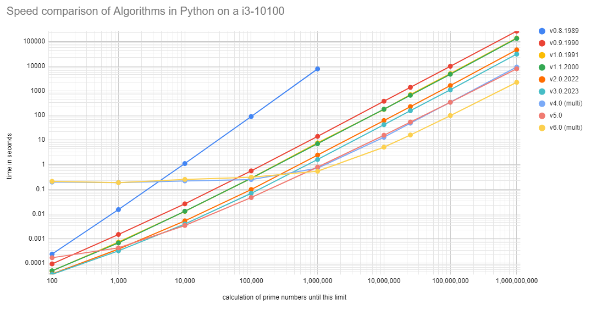
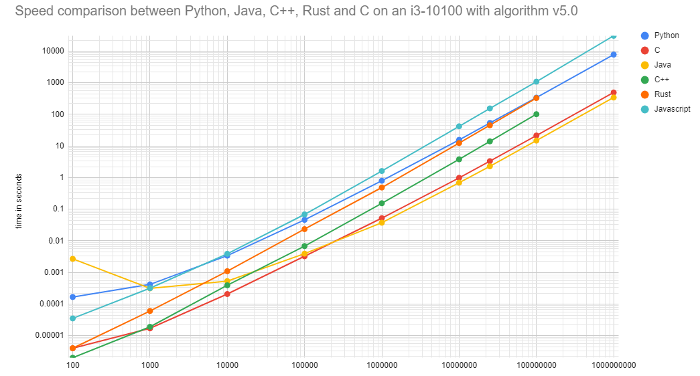
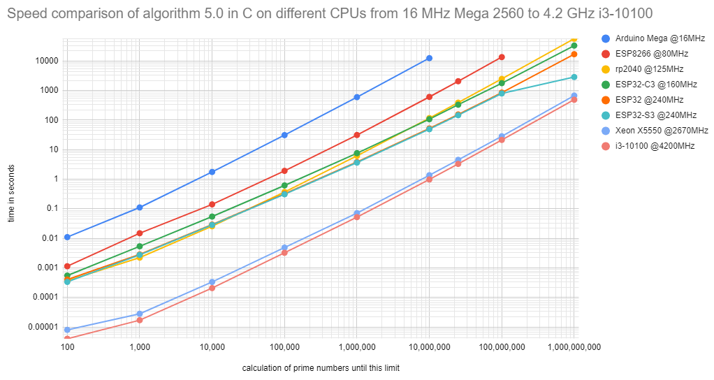
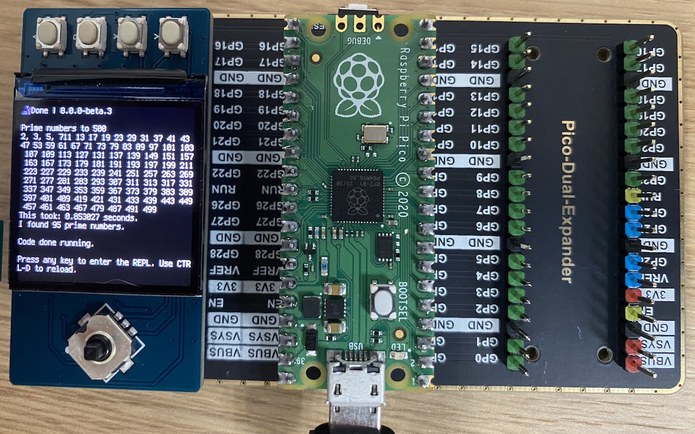

# Calculating prime numbers

[](https://GitHub.com/kreier/prime/releases/)
[](https://kreier.mit-license.org/)

This is just a simple benchmark tool to compare algorithms, programming languages and CPUs from microcomputers to workstations. I've been using this calculation since 1989. It is still usefull for microcontrollers like the T-Display with an esp32s2:


The code is only 14 lines short:

``` py
import math, time                    # v2.0.2022 in Python
last, found = 1000000, 4             # we start from 11, know already 2, 3, 5, 7
print(f"Calculating prime numbers to {last}.")
start = time.monotonic()
for number in range(11, last, 2):
    prime = True
    for divider in range(3, int(math.sqrt(number))+1, 2):
        if number % divider == 0:
            prime = False
            break
    if prime:
        found += 1
end = time.monotonic()
print(f"This took: {(end - start)} seconds. I found {found} prime numbers.")
```

## Increasing the speed - four parameters determine the runtime of the calculation

The runtime depends on four variables. Multicore can be considered under algorithm and is represented in v4.0 and c6.0:

- Used __Algorithm__ (e.g. 34x for v0.9 to v5.0 in Python)
- Used __programming language__ (c. 16x vor v5.0 from Python to C)
- __CPU__ running the algorithm (c. 2.1x for v5.0 Python from i5-2520M 3.2GHz to i3-10100 4.2 GHz)
- __Used range__ to investigate (e.g. 23x longer for 10x larger range 100 million instead of 10 million in Python v5.0)

### Better and faster algorithms

A faster way to calculate the prime numbers was already implemented 1991 in Omicron Basic on a Atari ST. By 2024 I collected 8 improvements to the algorithm.



- v0.8.1991	compare result of division to division with truncated decimal places
- v0.9.1991 use only divisors until the squareroot of the investigated number
- v1.0.1991	start with 11 in steps of 2 and use odd dividers from 3 on
- v1.1.2000	store result of the division, then check for decimal places
- v2.0.2022	use modulo operator for comparison
- v3.0.2023	put check for prime into a function
- v4.0.2023	write code to execute it in parallel
- v5.0.2023	calculate the prime numbers to the square root of the largest number, use these prime numbers as divisors for the remaining numbers
- v6.0.2024	make v5.0 in parallel without problems in the racing conditions

### Higher speed with other programming language

The same algorithm compiled in C for the prime numbers to 1,000,000 need just 0.049 seconds while Python3 needs 2.26 seconds to interpret the code and give the answer on my M1 Macbook.



With this simple example some 20x improvements can be seen. But the development does not stop, interpreters are getting faster and with special modules for special tasks a "slow" language might no longer be slow at all. While having the benefit of being easier to develop, prototype and maintain.

### Faster with a different CPU

Interestingly the improvement in CPU performance for this specific task is not as large as the increase in the frequency these chips run. The range from 16MHz on the Atmel826P for the Arudino Uno to the 4200MHz for the i3-10100 brings a speed improvement of 262x. And 64bit instead of 8 bit can bring another 8x just from the data and instruction side. With long prediction pipelines the increase in IPC over the years is still significant.




### Details to higher speed with a different programming language

|      language       | prime numbers | factor |
|--------------------:|--------------:|-------:|
|                   C |      0.0498 s |     51 |
|                Java |      0.0663 s |     34 |
|             Python3 |      2.2611 s |      1 |
|               Swift |               |        |
|          Javascript |               |        |
| Playgrounds (Swift) |      7.0413 s |   0.36 |

And the code from fast to slow:

#### C in 0.0498 seconds

``` c
#include <stdio.h>
#include <time.h>
#include <math.h>
#include <string.h>

int main() {
    int last = 1000000;
    int found = 4;   // we already know 2, 3, 5, 7
    const int arraylength = (int)(last / log(last));
    // printf("%d",arraylength);
    int primes[1000000] = {2, 3, 5, 7};
    clock_t start, end;
    double cpu_time_used;
    printf("Calculating prime numbers until %d\n", last);
    start = clock();
    for (int number = 11; number < last; number += 2) {
        int prime = 1;
        for (int divider = 3; divider < (int)(sqrt(number)) + 1; divider += 2) {
            if (number % divider == 0) {
                prime = 0;
                break;
            }
        }
        if (prime ==  1) {
            primes[found] = number;
            found += 1;
        }
    }
    end = clock();
    cpu_time_used = ((double) (end - start)) / CLOCKS_PER_SEC;
    for (int i = 0; i < found - 1; i++) {
        printf("%d, ",primes[i]);
    }
    printf("\nFound %d prime numbers.\n", found);
    printf("This took %f seconds.",cpu_time_used);
}
```

#### Java with OpenJDK 17.0.6 in 0.066340542 seconds

``` java
class prime {
  public static void main(String[] args) {
    int last = 1000000;
    int found = 4;
    System.out.println("Prime numbers to " + last);
    System.out.print("2, 3, 5, 7, ");
    long start = System.nanoTime();
    for(int number = 11; number < last; number = number + 2) {
      boolean prime = true;
      for(int divider = 3; divider < (int) Math.sqrt(number) + 1; divider = divider + 2) {
        if(number % divider == 0) {
          prime = false;
          break;
        }
      }
      if(prime) {
        found++;
        // System.out.print(", " + number);
      }
    }
    long end = System.nanoTime();
    System.out.print("\nI found " + found + " prime numbers.");
    System.out.print("This took me " + ((end - start) / 1000000000.0) + " seconds.");
  }
}
```

#### Python 3.9.12 in 2.2611 seconds

``` py
import math, time
last = 1000000
found = 4             # we start from 11, know 2, 3, 5, 7
print(f"Prime numbers to {last}")
start = time.monotonic()
for number in range(11, last, 2):
    prime = True
    for divider in range(3, int(math.sqrt(number))+1, 2):
        if number % divider == 0:
            prime = False
            break
    if prime:
        found += 1
end = time.monotonic()
print(f"This took: {(end - start)} seconds.")
print(f"I found {found} prime numbers.")
```

## Microcontroller MCUs

Today even microcontroller can drive color-tft displays, like here with a Raspberry Pi Pico 2040 on a 240px display with SP7789, running circuitpython:



The code is just a few lines:

``` py
import math, time, board, busio, terminalio, displayio
from adafruit_st7789 import ST7789
displayio.release_displays()
spi = busio.SPI(clock=board.GP10, MOSI=board.GP11)
tft_cs = board.GP9
tft_dc = board.GP8
display_bus = displayio.FourWire(
    spi, command=tft_dc, chip_select=tft_cs, reset=board.GP12
)
display = ST7789(display_bus, width=240, height=240, rowstart=80)
#splash = displayio.Group()
#display.show(splash)

last = 500
disp = True
found = 4             # we start from 11, know 2, 3, 5, 7
print(f"Prime numbers to {last}")
print("2, 3, 5, 7", end="")

start = time.monotonic()
for number in range(11, last, 2):
    prime = True
    for divider in range(3, int(math.sqrt(number))+1, 2):
        if number % divider == 0:
            prime = False
            break
    if prime:
        found += 1
        if disp:
            print(number, sep=', ', end=' ')
end = time.monotonic()
print(f"\nThis took: {(end - start)} seconds.")
print(f"I found {found} prime numbers.")
```

## Prime on MCUs

|  up to    | primes |       MHz |      80 |     240 |     125 |      240 |      160 |      240 |  3200 |
|----------:|-------:|-----------|--------:|--------:|--------:|---------:|---------:|---------:|------:|
|           |    #   | micro:bit | esp8266 |  ESP32  |  rp2040 | ESP32 S2 | ESP32 C3 | ESP32 S3 |   M1  |
|     1,000 |    168 |     0.694 |   0.182 |   0.036 |   0.043 |    0.139 |    0.027 |    0.016 | 0.000 |
|    10,000 |  1.229 |    13.517 |   3.360 |   0.626 |   0.797 |    0.769 |    0.487 |    0.259 | 0.008 |
|   100,000 |  9.592 |   318.459 |  71.008 |  12.766 |  17.028 |   10.278 |   10.037 |    5.607 | 0.111 |
| 1,000,000 | 78.498 |           | 599.490 | 294.419 | 396.301 |  201.873 |  232.850 |  130.837 | 2.599 |

And now in Arduino C

|     range | prime numbers | esp8266 80 MHz | ESP32 240 MHz | rp2040 125 MHz | ESP32-S2 240 MHz | ESP32-C3 160 MHz | ESP32-S3 240 MHz | M1 3200 MHz |
|----------:|--------------:|:--------------:|:-------------:|:--------------:|:----------------:|:----------------:|:----------------:|:-----------:|
|     1,000 |           168 |           0.04 |          0.01 |           0.03 |                  |             0.02 |             0.01 |             |
|    10,000 |         1,229 |            0.9 |          0.24 |           0.66 |                  |             0.43 |             0.22 |             |
|   100,000 |         9,592 |          21.54 |          5.65 |          15.82 |                  |            10.16 |             5.20 |             |
| 1,000,000 |        78,498 |         541.01 |        140.47 |         395.94 |                  |           252.78 |           129.44 |       0.054 |
| 1,000,000 |        78.498 |        599.490 |       294.419 |        396.301 |          201.873 |          232.850 |          130.837 |             |


## Does my code work?

A quick check to see if the code works as intended is the number of primes it finds in a certain range:

|     range     | prime numbers |
|--------------:|--------------:|
|            10 |             4 |
|           100 |            25 |
|         1,000 |           168 |
|        10,000 |         1,229 |
|       100,000 |         9,592 |
|     1,000,000 |        78,498 |
|    10,000,000 |       664,579 |
|   100,000,000 |     5,761,455 |
| 1,000,000,000 |    50,847,534 |
| 2,147,483,647 |   105,097,564 |
| 4,294,967,295 |   203,280,221 |

## Faster with Multithreading - 4.9x faster

This should work even with Python. For comparison we start with the calculation to 10 million and find 664,579 prime numbers. On my i3-10100 this takes 63 seconds. This could be improved by putting the check for a prime number into a function and the loop into the main function. We are down to 42.4 seconds (33% faster) with the following code:

``` py
import math, time

last = 10000000
found = 4             # we start from 11, know 2, 3, 5, 7

def is_prime(number):
    global found
    flag_prime = True
    for divider in range(3, int(math.sqrt(number))+1, 2):
        if number % divider == 0:
            flag_prime = False
            break
    if flag_prime:
        found += 1

if __name__ == "__main__":
    print(f"Prime numbers to {last}")
    start = time.perf_counter()
    for number in range(11, last, 2):
        is_prime(number)
    end = time.perf_counter()
    print(f"This took: {(end - start)} seconds.")
    print(f"I found {found} prime numbers. For 10M it should be 664,579.")
```

For multiprocessing we need to add a few lines, but the code is now executed in 12.87 seconds - 3.296x faster.

``` py
import math, time, multiprocessing

last = 10000000
found = 4             # we start from 11, know 2, 3, 5, 7
queue = multiprocessing.Queue()

def is_prime(number):
    flag_prime = True
    for divider in range(3, int(math.sqrt(number))+1, 2):
        if number % divider == 0:
            flag_prime = False
            break
    if flag_prime:
        return number
    else:
        return 0

if __name__ == "__main__":
    print(f"Prime numbers to {last}")
    start = time.perf_counter()
    print("Create pool")
    pool = multiprocessing.Pool()
    results = pool.map(is_prime, range(11, last, 2))
    pool.close()
    for nr in results:
        if nr > 0:
            found += 1
    end = time.perf_counter()
    print(f"This took: {(end - start)} seconds.")
    print(f"I found {found} prime numbers. For 10 million it should be 664,579.")
```

And finally: For the original 1 million it takes 0.702 seconds. Not so far from the 0.128 seconds in C (5.5x slower). Which makes we wonder: How fast would it be in Rust or in C in parallel?

## Even faster with the Sieve of Eratosthenes?

This [algorithm](https://en.wikipedia.org/wiki/Sieve_of_Eratosthenes) is known and documented for almost 2000 years. How much faster would it be than the brute force method above? Time to find out.

One limitation could be the required memory for the primes. Let's say I want to know the primes until 2E32 or 4,294,967,295. With the previous algorithm I would need 32bit x 203,280,221 primes = 813,120,884 byte. That's 775 MByte. Using the Sieve of Eratosthenes I could only include the odd numbers (I know the only even prime number - two) and just use one bit to represent if a number is prime (1) or not (0). Then each byte gives 8 numbers, and we need 4,294,967,295 / 2 / 8 = 268,435,456 bute = 256 MByte. It is actually less RAM demanding!

Later 2024 I will give it a try.
