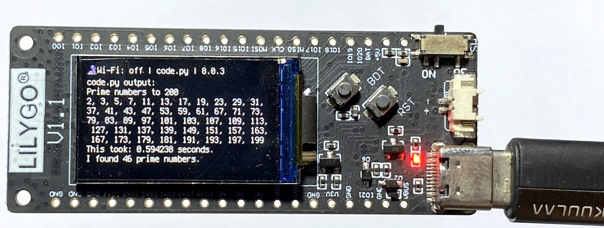

# Calculating prime numbers

[](https://GitHub.com/kreier/prime/releases/)
[](https://kreier.mit-license.org/)

The main goal is to serve as a small benchmark to compare algorithms, programming languages and CPUs from microcomputers to workstations. I've been using this calculation since 1989. And it is usefull even for microcontroller, like the T-Display with a esp32s2:



The code is rather short:

``` py
import math, time
last = 1000000
found = 4             # we start from 11, know 2, 3, 5, 7
print(f"Prime numbers to {last}")
start = time.monotonic()
for number in range(11, last, 2):
    prime = True
    for divider in range(3, int(math.sqrt(number))+1, 2):
        if number % divider == 0:
            prime = False
            break
    if prime:
        found += 1
end = time.monotonic()
print(f"This took: {(end - start)} seconds.")
print(f"I found {found} prime numbers.")
```

## Does my code work

A quick check (aside from obvious mistakes with even prime numbers as result) you can check how many primes your code finds to check if it works correctly:

|   range   | prime numbers |
|----------:|--------------:|
|        10 |             4 |
|       100 |            25 |
|     1,000 |           168 |
|    10,000 |         1,229 |
|   100,000 |         9,592 |
| 1,000,000 |        78,498 |

## Speed comparison on a M1 Mac

The same algorithm compiled in C for the prime numbers to 1,000,000 need just 0.049 seconds while Python3 needs 2.26 seconds to interpret the code and give the answer.

|      language       | prime numbers | factor |
|--------------------:|--------------:|-------:|
|                   C |      0.0498 s |     51 |
|                Java |      0.0663 s |     34 |
|             Python3 |      2.2611 s |      1 |
|               Swift |               |        |
|          Javascript |               |        |
| Playgrounds (Swift) |      7.0413 s |   0.36 |

And the code from fast to slow:

### C in 0.0498 seconds

``` c
#include <stdio.h>
#include <time.h>
#include <math.h>
#include <string.h>

int main() {
    int last = 1000000;
    int found = 4;   // we already know 2, 3, 5, 7
    const int arraylength = (int)(last / log(last));
    // printf("%d",arraylength);
    int primes[1000000] = {2, 3, 5, 7};
    clock_t start, end;
    double cpu_time_used;
    printf("Calculating prime numbers until %d\n", last);
    start = clock();
    for (int number = 11; number < last; number += 2) {
        int prime = 1;
        for (int divider = 3; divider < (int)(sqrt(number)) + 1; divider += 2) {
            if (number % divider == 0) {
                prime = 0;
                break;
            }
        }
        if (prime ==  1) {
            primes[found] = number;
            found += 1;
        }
    }
    end = clock();
    cpu_time_used = ((double) (end - start)) / CLOCKS_PER_SEC;
    for (int i = 0; i < found - 1; i++) {
        printf("%d, ",primes[i]);
    }
    printf("\nFound %d prime numbers.\n", found);
    printf("This took %f seconds.",cpu_time_used);
}
```

### Java with OpenJDK 17.0.6 in 0.066340542 seconds

``` java
class prime {
  public static void main(String[] args) {
    int last = 1000000;
    int found = 4;
    System.out.println("Prime numbers to " + last);
    System.out.print("2, 3, 5, 7, ");
    long start = System.nanoTime();
    for(int number = 11; number < last; number = number + 2) {
      boolean prime = true;
      for(int divider = 3; divider < (int) Math.sqrt(number) + 1; divider = divider + 2) {
        if(number % divider == 0) {
          prime = false;
          break;
        }
      }
      if(prime) {
        found++;
        // System.out.print(", " + number);
      }
    }
    long end = System.nanoTime();
    System.out.print("\nI found " + found + " prime numbers.");
    System.out.print("This took me " + ((end - start) / 1000000000.0) + " seconds.");
  }
}
```

### Python 3.9.12 in 2.2611 seconds

``` py
import math, time
last = 1000000
found = 4             # we start from 11, know 2, 3, 5, 7
print(f"Prime numbers to {last}")
start = time.monotonic()
for number in range(11, last, 2):
    prime = True
    for divider in range(3, int(math.sqrt(number))+1, 2):
        if number % divider == 0:
            prime = False
            break
    if prime:
        found += 1
end = time.monotonic()
print(f"This took: {(end - start)} seconds.")
print(f"I found {found} prime numbers.")
```

## Microcontroller MCUs

Today even microcontroller can drive color-tft displays, like here with a Raspberry Pi Pico 2040 on a 240px display with SP7789, running circuitpython:


The code is just a few lines:

``` py
import math, time, board, busio, terminalio, displayio
from adafruit_st7789 import ST7789
displayio.release_displays()
spi = busio.SPI(clock=board.GP10, MOSI=board.GP11)
tft_cs = board.GP9
tft_dc = board.GP8
display_bus = displayio.FourWire(
    spi, command=tft_dc, chip_select=tft_cs, reset=board.GP12
)
display = ST7789(display_bus, width=240, height=240, rowstart=80)
#splash = displayio.Group()
#display.show(splash)

last = 500
disp = True
found = 4             # we start from 11, know 2, 3, 5, 7
print(f"Prime numbers to {last}")
print("2, 3, 5, 7", end="")

start = time.monotonic()
for number in range(11, last, 2):
    prime = True
    for divider in range(3, int(math.sqrt(number))+1, 2):
        if number % divider == 0:
            prime = False
            break
    if prime:
        found += 1
        if disp:
            print(number, sep=', ', end=' ')
end = time.monotonic()
print(f"\nThis took: {(end - start)} seconds.")
print(f"I found {found} prime numbers.")
```

## Prime on MCUs

| Python    |    MHz |           |      80 |     160 |     240 |     125 |      240 |      160 |      240 |  3200 |
|-----------|-------:|-----------|--------:|--------:|--------:|--------:|---------:|---------:|---------:|------:|
|           |    #   | micro:bit | esp8266 | esp8266 |  ESP32  |  rp2040 | ESP32 S2 | ESP32 C3 | ESP32 S3 |   M1  |
|     1,000 |    168 |     0.694 |   0.182 |   0.110 |   0.036 |   0.043 |    0.139 |    0.027 |    0.016 | 0.000 |
|    10,000 |  1.229 |    13.517 |   3.360 |   1.970 |   0.626 |   0.797 |    0.769 |    0.487 |    0.259 | 0.008 |
|   100,000 |  9.592 |   318.459 |  71.008 |  40.950 |  12.766 |  17.028 |   10.278 |   10.037 |    5.607 | 0.111 |
| 1,000,000 | 78.498 |           | 599.490 |         | 294.419 | 396.301 |  201.873 |  232.850 |  130.837 | 2.599 |

And now in Arduino C

|     range | prime numbers | esp8266 80 MHz | esp8266 160 MHz | ESP32 240 MHz | rp2040 125 MHz | ESP32-S2 240 MHz | ESP32-C3 160 MHz | ESP32-S3 240 MHz | M1 3200 MHz |
|----------:|--------------:|:--------------:|:---------------:|:-------------:|:--------------:|:----------------:|:----------------:|:----------------:|:-----------:|
|     1,000 |           168 |           0.04 |            0.02 |          0.01 |           0.03 |                  |             0.02 |             0.01 |             |
|    10,000 |         1,229 |            0.9 |            0.45 |          0.24 |           0.66 |                  |             0.43 |             0.22 |             |
|   100,000 |         9,592 |          21.54 |           10.76 |          5.65 |          15.82 |                  |            10.16 |              5.2 |             |
| 1,000,000 |        78,498 |         541.01 |          270.24 |        140.47 |         395.94 |                  |           252.78 |           129.44 |       0.054 |
| 1,000,000 |        78.498 |        599.490 |                 |       294.419 |        396.301 |          201.873 |          232.850 |          130.837 |             |


